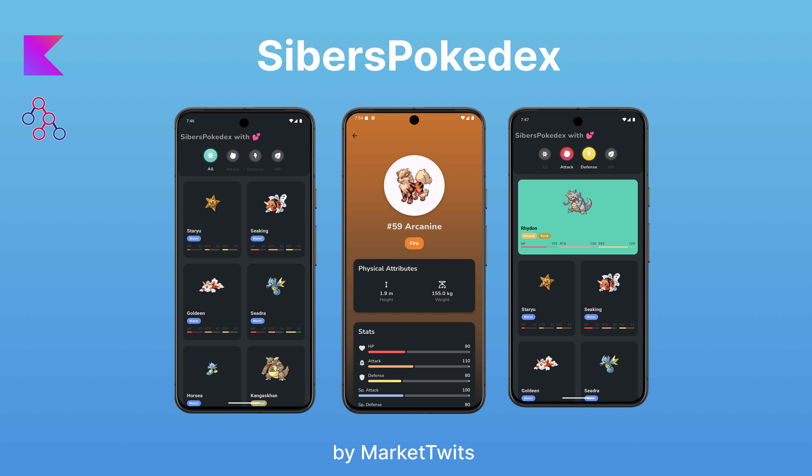
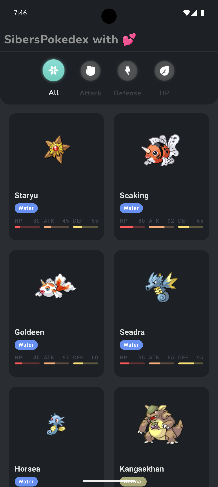
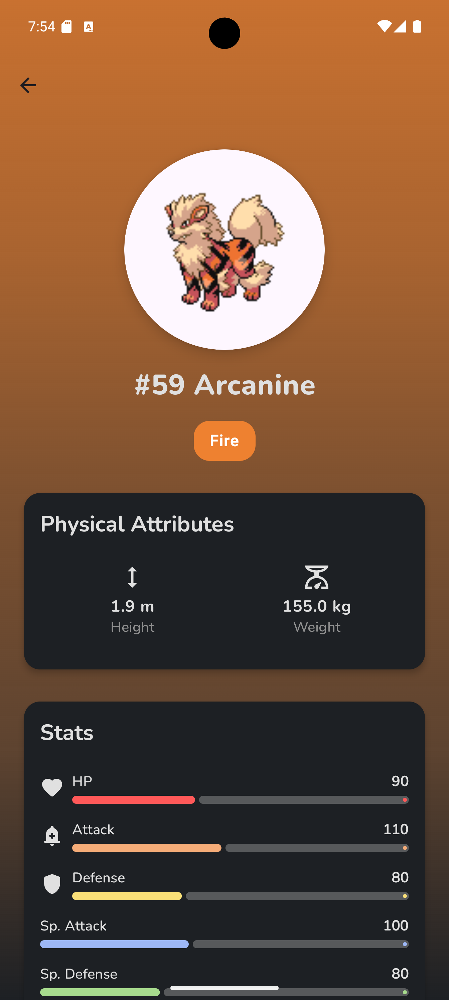
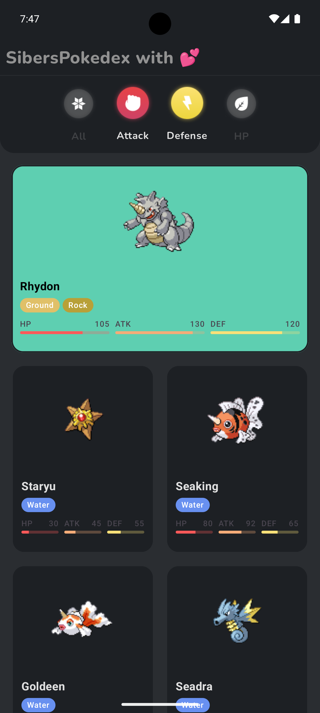
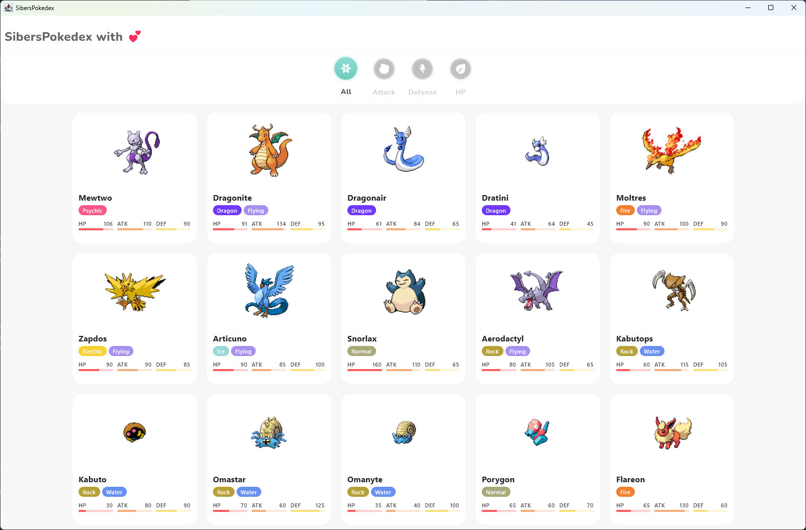
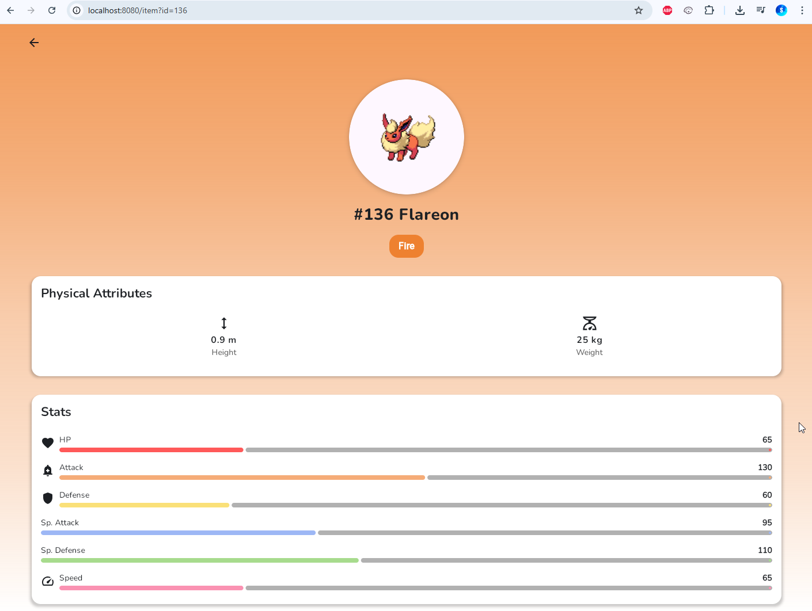

# SibersPokedex

Pokedex is kotlin multiplatform project with 99% shared code, built with Compose multiplatform, Coroutines, Flow, Decompose, MVIKotlin, Koin, Ktor, SqlDelight, and Material 3 based on MVI architecture
 
 

## ESSENCE OF THE TASK
Using the server API https://pokeapi.co/, create an Android application that:

1. Displays a list of 30 Pokémon on the main screen. Each list item must contain at least the Pokémon's name and its image.
2. Adds the ability to view detailed information about a Pokémon. Create a separate screen accessible by clicking on any Pokémon in the list. The detailed information must include at least the following fields:
  - Height
  - Weight
  - Type (e.g., bird, insect, poison, etc.)
  - Stats (including attack, defense, hp)
3. Implement pagination for the Pokémon list: when scrolling reaches the end of the list, load the next 30 items and display them.
4. Add a button to the main screen that, when pressed, reinitializes the Pokémon list starting from a random element in the server's Pokémon database. The minimum list length should always be at least 30 elements.
5. Add 3 checkboxes to the main screen labeled "attack", "defense", and "hp" with the following behavior:
  - When a checkbox is activated (attack/defense/hp), search for the Pokémon with the highest value in the corresponding stat (attack/defense/hp) among the current list.
  - Move the found Pokémon to the beginning of the list and scroll the list to the top if necessary, visually highlighting this item.
  - If two or three checkboxes are selected, find the Pokémon with the highest values in all selected stats. If it's impossible to definitively determine the strongest Pokémon based on the selected stats, handle it at your discretion.

## ADDITIONAL TASKS
1. Extension of item 5: implement the search for the strongest Pokémon by one selected stat in the most optimal way.
2. Instead of search (item 5), you can implement sorting of the current Pokémon list by selected stats.
3. Implement caching of already loaded list items so that all functionality remains available when opening the app without an internet connection.

## Screenshots
  ### Android
  
  

  
  
  
  

  ### Desktop
  

  ### Web
  

## PokeAPI

Pokedex uses [PokeAPI](https://pokeapi.co/) for fetching data related to Pokémon.

